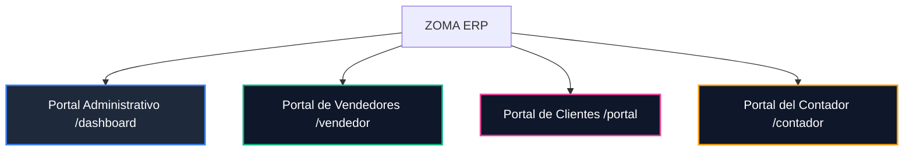

# 🚀 ZOMA ERP - Sistema de Gestión Comercial SaaS Multi-Tenant

**ZOMA ERP** es una plataforma SaaS (Software as a Service) de alto rendimiento diseñada para la gestión comercial integral de PyMEs, mayoristas y distribuidores. La plataforma permite administrar en tiempo real presupuestos, pedidos, stock, proveedores, tesorería y cuentas corrientes comerciales bajo una arquitectura robusta, escalable y aislada para múltiples empresas (multi-tenant).

Desarrollada con tecnologías modernas y optimizada para soportar flujos transaccionales reales, ZOMA ERP implementa un esquema de **Cuatro Portales Especializados**, facturación electrónica oficial (AFIP), cobros integrados vía Mercado Pago y mensajería instantánea en tiempo real.

---

## 🧭 Arquitectura de Portales y Roles (RBAC)

La aplicación implementa un control de acceso basado en roles (RBAC) aislado a través de un Middleware de Next.js. Esto segmenta la aplicación en cuatro universos lógicos:



### 👔 1. Portal Administrativo (`app/(app)/`)
*   **Actor**: Propietarios de la empresa y administradores.
*   **Funcionalidades**:
    *   **Dashboard Financiero**: Métricas dinámicas de ventas, saldos de cuentas corrientes, compras del mes e ingresos proyectados.
    *   **Catálogo Global**: ABM de productos con control de costos, precios sugeridos, márgenes de ganancia y actualizaciones masivas.
    *   **Cuentas Corrientes & Tesorería**: Registro y auditoría de movimientos de caja (débito/crédito), conciliaciones manuales de deudas y control de caja diaria.
    *   **Módulo de Ventas y Compras**: Emisión de presupuestos comerciales, conversión a pedidos firmes y registro de facturas de proveedores.
    *   **Marca Blanca**: Subida de logo corporativo y parametrización de condiciones comerciales por defecto.

### 🚗 2. Portal de Vendedores (`app/vendedor/`)
*   **Actor**: Fuerza de ventas en la calle (Preventistas).
*   **Funcionalidades**:
    *   **Experiencia Mobile-First**: Optimizado para la carga rápida de pedidos desde dispositivos móviles en el comercio del cliente.
    *   **Validación Preventiva**: Consulta interactiva de deudas del cliente antes de confirmar una nueva venta.
    *   **Scoping Comercial**: Acceso restringido. Cada vendedor visualiza y opera únicamente con su cartera de clientes asignada (`seller_id`).

### 🛍️ 3. Portal de Clientes (`app/portal/`)
*   **Actor**: Clientes finales del tenant.
*   **Funcionalidades**:
    *   **Autogestión de Pedidos**: Los clientes pueden ver el catálogo, armar carritos y enviar pedidos directos a administración.
    *   **Estado de Cuentas**: Visualización interactiva de su saldo histórico y descarga digital de resúmenes de cuenta corriente.
    *   **Pasarela de Pagos**: Cancelación autónoma de saldos pendientes mediante tarjetas o dinero en cuenta vía Mercado Pago.

### 👔 4. Portal del Contador (`app/(app)/contador/`)
*   **Actor**: Estudio contable externo de la empresa.
*   **Funcionalidades**:
    *   **Exportación Fiscal**: Acceso directo para la descarga de reportes de IVA Ventas y facturas en formato TXT listos para importar al aplicativo de la **AFIP (Libro de IVA Digital)**.
    *   **Visibilidad Financiera**: Consulta consolidada de facturas emitidas, retenciones impositivas y saldos sin requerir soporte administrativo diario.

---

## 🛡️ Aislamiento de Datos Multi-Tenant (Supabase RLS)

Para garantizar la seguridad de los datos de cada tenant, el sistema se apoya en **Row Level Security (RLS)** de PostgreSQL. Ninguna consulta SQL puede leer o escribir registros de una empresa ajena, incluso si se conocen los identificadores UUID.

### Estructura de Seguridad a Nivel de Base de Datos
La seguridad se centraliza en una función definidora (`is_member_of`) en PostgreSQL que contrasta el `company_id` con el perfil del usuario autenticado:

```sql
-- Función auxiliar para validación de pertenencia
CREATE OR REPLACE FUNCTION public.is_member_of(company_uuid uuid)
RETURNS boolean AS $$
BEGIN
  RETURN EXISTS (
    SELECT 1 FROM public.users_profiles
    WHERE id = auth.uid() AND company_id = company_uuid
  ) OR EXISTS (
    SELECT 1 FROM public.customer_users
    WHERE auth_user_id = auth.uid() AND company_id = company_uuid
  );
END;
$$ LANGUAGE plpgsql SECURITY DEFINER;

-- Aplicación de política de aislamiento
ALTER TABLE public.products ENABLE ROW LEVEL SECURITY;

CREATE POLICY "Aislamiento por Empresa" ON public.products
  FOR ALL
  USING (is_member_of(company_id));
```

### Caché de Sesión en Middleware
Para optimizar el rendimiento y evitar consultas redundantes a la base de datos en cada petición HTTP, el [middleware.ts](file:///c:/Users/Nailen/Desktop/Proyectos/presupuesto-app/middleware.ts) implementa un caché de sesión cifrado mediante cookies por 2 horas, controlando el rol del usuario y el estado de la suscripción (`sb-company-expiry`):

```typescript
// Cache miss: si falta el rol o la expiración de la empresa, consultamos la DB
if (!rol || !vencimientoEmpresa) {
  const { data: perfil } = await supabase
    .from('users_profiles')
    .select(`
      role,
      company_id,
      companies ( subscription_expiry )
    `)
    .eq('id', usuario.id)
    .single()

  if (perfil) {
    rol = perfil.role
    vencimientoEmpresa = perfil.companies?.subscription_expiry || 'none'

    // Guardamos en una cookie segura para evitar lecturas 
    respuesta.cookies.set('sb-company-expiry', String(vencimientoEmpresa), {
      maxAge: 60 * 60 * 2, // Cache de 2 horas
      path: '/',
      httpOnly: true,
      secure: true,
      sameSite: 'lax',
    })
  }
}
```

---

## 💳 Integración Multitransaccional con Mercado Pago

A diferencia de las integraciones tradicionales donde los fondos van a una única cuenta de la plataforma, ZOMA ERP implementa un esquema **Multi-Merchant OAuth 2.0**. Cada empresa (tenant) vincula su propia cuenta de Mercado Pago desde el panel de configuración, cobrando sus ventas directamente y de forma aislada.

### 1. Refresco Automático de Tokens OAuth (Offline Access)
Dado que las credenciales de Mercado Pago expiran periódicamente, el sistema refresca automáticamente los Access Tokens de forma transparente utilizando el Refresh Token almacenado:

```typescript
// [lib/mercadopago/refreshAccessToken.ts]
export async function getValidMercadoPagoAccessToken(companyId: string): Promise<string | null> {
  const { data: account } = await supabaseAdmin
    .from('mp_accounts')
    .select('company_id, access_token, refresh_token, expires_at')
    .eq('company_id', companyId)
    .eq('connected', true)
    .single()

  if (!account) return null

  const now = Date.now()
  const expiresAt = account.expires_at ? new Date(account.expires_at).getTime() : 0
  const fiveMinutes = 5 * 60 * 1000

  // Si aún es válido, lo retornamos sin llamar al servidor de MP
  if (expiresAt && (expiresAt - now > fiveMinutes)) {
    return account.access_token
  }

  if (!account.refresh_token) return null

  // Solicitud de renovación a Mercado Pago
  const tokenResponse = await fetch('https://api.mercadopago.com/oauth/token', {
    method: 'POST',
    headers: {
      'Content-Type': 'application/json',
      Accept: 'application/json',
    },
    body: JSON.stringify({
      grant_type: 'refresh_token',
      client_id: process.env.MERCADOPAGO_CLIENT_ID,
      client_secret: process.env.MERCADOPAGO_CLIENT_SECRET,
      refresh_token: account.refresh_token,
    }),
  })

  const tokenData = await tokenResponse.json()
  if (!tokenResponse.ok) return null

  const newExpiresAt = new Date(Date.now() + Number(tokenData.expires_in) * 1000).toISOString()

  // Guardamos las credenciales renovadas
  await supabaseAdmin
    .from('mp_accounts')
    .update({
      access_token: tokenData.access_token,
      refresh_token: tokenData.refresh_token || account.refresh_token,
      expires_at: newExpiresAt,
      updated_at: new Date().toISOString(),
    })
    .eq('company_id', companyId)

  return tokenData.access_token
}
```

### 2. Generación Dinámica de Preferencias de Pago
El sistema expone un endpoint centralizado que valida los permisos de seguridad y crea la orden de pago en Mercado Pago apuntando la recaudación a las credenciales específicas del tenant correspondiente:

```typescript
// [app/api/mercadopago/create-preference/route.ts]
const accessToken = await getValidMercadoPagoAccessToken(paymentData.company_id)
if (!accessToken) {
  return NextResponse.json({ error: 'Falta vinculación de Mercado Pago' }, { status: 400 })
}

const preferenceResponse = await fetch('https://api.mercadopago.com/checkout/preferences', {
  method: 'POST',
  headers: {
    Authorization: `Bearer ${accessToken}`,
    'Content-Type': 'application/json',
  },
  body: JSON.stringify({
    items: [
      {
        title: paymentData.title,
        quantity: 1,
        currency_id: 'ARS',
        unit_price: Number(paymentData.balance.toFixed(2)),
      },
    ],
    payer: { email: user.email },
    external_reference: paymentData.external_reference, // Vincula el ID del presupuesto/pedido
    notification_url: `${appUrl}/api/mercadopago/webhook`,
    back_urls: {
      success: `${appUrl}/portal/pagos/success`,
      failure: `${appUrl}/portal/pagos/failure`,
      pending: `${appUrl}/portal/pagos/pending`,
    },
    auto_return: 'approved',
    binary_mode: true,
  }),
})
```

---

## 📈 Colaboración y Monitoreo en Tiempo Real (Real-time)

La plataforma utiliza los canales de transmisión (Websockets) de Supabase para ofrecer una experiencia colaborativa viva en el día a día operativo:

### 1. Muro General y Chats de Pedidos
El componente de chat dinámico (`GlobalChatBubble`) implementa canales en tiempo real filtrados a nivel cliente-servidor por `company_id`. Asimismo, incluye seguimiento del estado de conexión de los miembros del equipo:

```typescript
// Suscripción al canal de mensajería interno de la empresa
const channel = supabase
  .channel(`company-chat-${companyId}`)
  .on('postgres_changes', { 
    event: 'INSERT', 
    schema: 'public', 
    table: 'company_messages', 
    filter: `company_id=eq.${companyId}` 
  }, async (payload) => {
    const newMsg = payload.new as Message
    
    // Verificar si el mensaje está destinado a mí o al canal general
    const isForMe = !newMsg.receiver_id || newMsg.receiver_id === currentUserId || newMsg.sender_id === currentUserId
    if (!isForMe) return
    
    const { data: profile } = await supabase.from('users_profiles').select('full_name, role').eq('id', newMsg.sender_id).single()
    setMessages((prev) => [...prev, { ...newMsg, profiles: profile || undefined }])
  })
  .subscribe()

// Registro y visualización del estado de presencia (Online / Offline)
const presenceChannel = supabase.channel(`presence-${companyId}`, {
  config: { presence: { key: currentUserId } }
})

presenceChannel
  .on('presence', { event: 'sync' }, () => {
    const newState = presenceChannel.presenceState()
    setOnlineUsers(new Set(Object.keys(newState)))
  })
  .subscribe(async (status) => {
    if (status === 'SUBSCRIBED') {
      await presenceChannel.track({ online_at: new Date().toISOString() })
    }
  })
```

### 2. Trazabilidad de Lectura de Presupuestos (Real-time Visualizer)
Cuando un administrador o vendedor comparte el enlace público de un presupuesto (`app/p/[id]`), el sistema detecta de forma pasiva cuándo el cliente visualiza el documento mediante un disparador de analítica silencioso:

```typescript
// Registro automático de lectura de presupuesto [app/p/[id]/BudgetPublicClient.tsx]
useEffect(() => {
  if (id) {
    // Carga de información y posterior tracking
    loadPublicData().then((budgetId) => {
      fetch('/api/budgets/track-view', {
        method: 'POST',
        headers: { 'Content-Type': 'application/json' },
        body: JSON.stringify({ budgetId })
      }).catch(e => console.error(e))
    })
  }
}, [id])
```
Esto actualiza la columna `viewed_at` utilizando credenciales administrativas de bypass (`supabaseServiceRole`) ya que el cliente externo no cuenta con credenciales en la base de datos. Los vendedores y administradores verán instantáneamente en su panel administrativo el indicador visual del "Ojo" con el timestamp exacto en que fue leído.

---

## 🧾 Facturación Electrónica e IVA Digital (Integración AFIP)

ZOMA ERP automatiza las obligaciones impositivas en Argentina conectando el backend con los servidores de homologación y producción de la AFIP (Administración Federal de Ingresos Públicos).

### Flujo de Emisión de Facturas (CAE)
1.  **Validación de Datos**: Control de CUIT del emisor y receptor, alícuota de IVA correspondiente según condición fiscal y obligatoriedad de campos de servicio (rango de fechas).
2.  **Firma del XML**: Comunicación directa vía SDK `afip-apis` para obtener el **CAE (Código de Autorización Electrónico)** y su fecha de vencimiento legal.
3.  **Generación Impositiva**: Exportación del Libro de IVA Digital. El portal de contadores compila los movimientos y genera el layout TXT exigido por AFIP:

```typescript
// [app/api/reports/libro-iva-digital/route.ts]
// Formateo estricto del archivo de importación AFIP (IVA Ventas - Cabecera)
function formatAfipAmount(amount: number): string {
  // Multiplicado por 100, sin puntos ni comas, rellenado con ceros a la izquierda (15 caracteres)
  const integerVal = Math.round(amount * 100)
  return String(integerVal).padStart(15, '0')
}

// Composición del registro del comprobante (Cumpliendo especificación de RG AFIP)
let registro = ''
registro += f.invoice_date.replace(/-/g, '')           // 01-08: Fecha de comprobante
registro += padZeros(f.afip_comprobante_tipo, 3)        // 09-11: Tipo de comprobante
registro += padZeros(f.invoice_point_of_sale, 5)        // 12-16: Punto de venta
registro += padZeros(f.afip_comprobante_numero, 20)     // 17-36: Número de comprobante
...
registro += formatAfipAmount(total)                     // 100-114: Importe Total
registro += formatAfipAmount(esInscripto ? neto : 0)    // 130-144: Neto Gravado
registro += formatAfipAmount(iva)                       // 145-159: IVA Liquidado
```

---

## 🛡️ Estrategia de Control de Errores y Resiliencia

El diseño arquitectónico de ZOMA ERP minimiza los puntos únicos de fallo y previene inconsistencias mediante varios mecanismos estructurados de control de errores:

### 1. Prevención de Ataques de Replay en Webhooks (Mercado Pago)
Los webhooks de pagos imponen una verificación de firma criptográfica Hmac-SHA256 y control de ventanas de tiempo para evitar falsificaciones de transacciones:

```typescript
// [lib/mercadopago/verifyWebhookSignature.ts]
export function verifyMercadoPagoWebhookSignature(req: NextRequest) {
  const secret = process.env.MERCADOPAGO_WEBHOOK_SECRET?.trim()
  const xSignature = req.headers.get('x-signature')
  const xRequestId = req.headers.get('x-request-id')

  if (!secret || !xSignature) return false

  // Parsear firma: contiene timestamp 'ts' y firma 'v1'
  let ts = '', receivedHash = ''
  xSignature.split(',').forEach(part => {
    const [key, value] = part.split('=')
    if (key?.trim() === 'ts') ts = value?.trim()
    if (key?.trim() === 'v1') receivedHash = value?.trim()
  })

  // Reconstrucción del manifiesto recibido
  const dataId = new URL(req.url).searchParams.get('id') || ''
  const manifest = `id:${dataId};request-id:${xRequestId};ts:${ts};`

  const generatedHash = crypto.createHmac('sha256', secret).update(manifest).digest('hex')

  // safeCompare previene ataques de temporización (Timing Attacks)
  const isHashValid = safeCompare(generatedHash, receivedHash)

  // Validación de tolerancia horaria (Tolerancia máxima de 10 minutos)
  const timestampMs = Number(ts) * 1000
  const isWithinTolerance = Math.abs(Date.now() - timestampMs) < 10 * 60 * 1000

  return isHashValid && isWithinTolerance;
}
```

### 2. Manejo de Estado y Consistencia Transaccional
*   **Aislamiento en Base de Datos**: Toda conversión de presupuesto a pedido clona los precios de las líneas de artículos, protegiendo las condiciones comerciales del presupuesto en caso de posteriores actualizaciones de precios en el catálogo.
*   **Validación de Entradas (UX)**: Validaciones inmediatas a nivel UI (CUIT correcto mediante algoritmos de módulo 11, inputs numéricos desinfectados que bloquean cantidades o importes negativos).
*   **Alertas Dinámicas**: Integración de notificaciones táctiles y visuales mediante `sonner` para garantizar feedback de excepciones de conexión o API caídas sin romper la navegación.

---
*Diseño y documentación técnica preparados para la presentación de Portfolio Profesional - ZOMA ERP v2.0*
