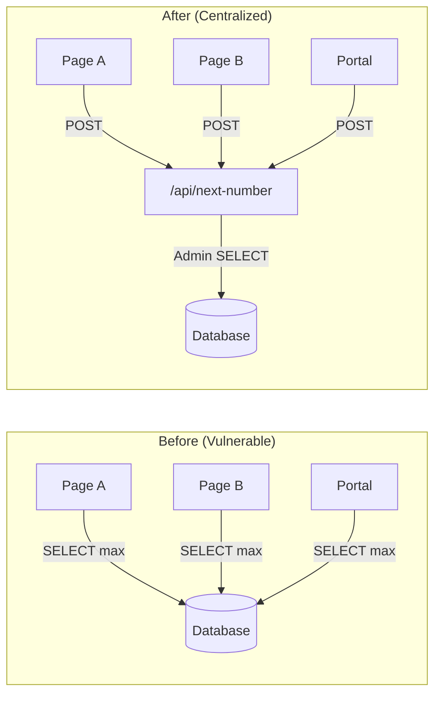
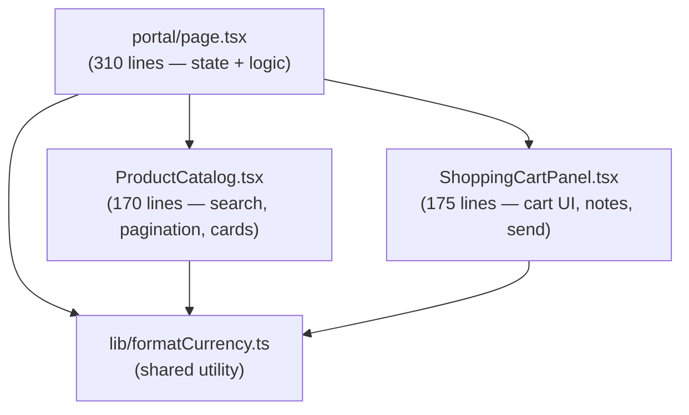
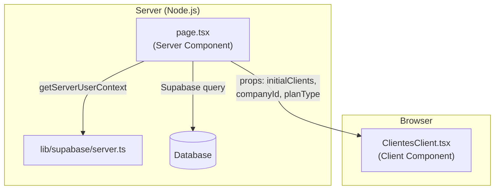
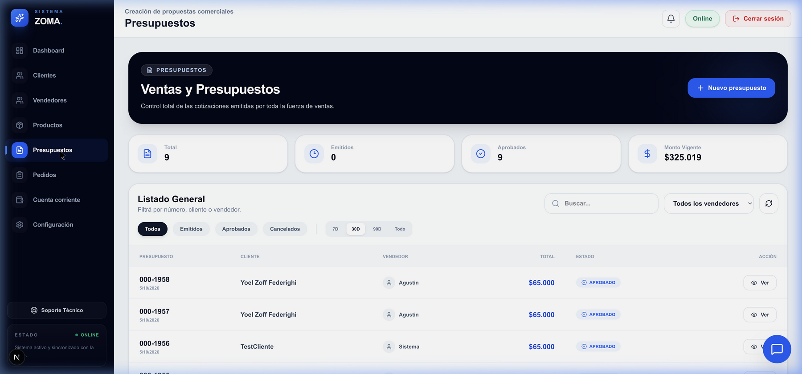
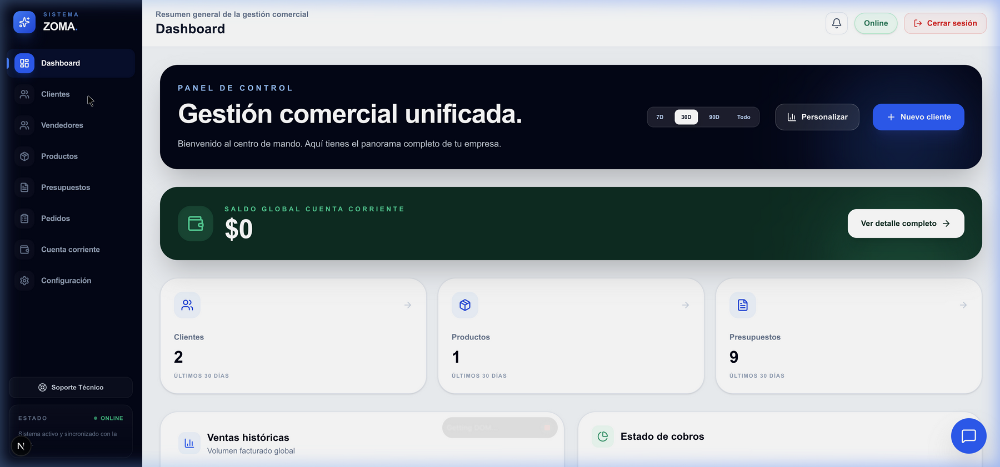

# 🏗️ ZOMA ERP — Architecture Improvements

**Date**: 2026-05-11  
**Tasks Completed**: 3 major refactors  
**Files Created**: 8 | **Files Modified**: 7 | **Net Lines Saved**: ~600

---

## Task 1: Migrate to `/api/next-number` ✅

Eliminated race conditions in sequential number generation by routing all budget/order numbering through a centralized server API.

### Architecture

### Files Changed

| File | Change |
|:---|:---|
| [lib/fetchNextNumber.ts](file:///Users/fabriz/dev/yoel/presupuestosZOMA/lib/fetchNextNumber.ts) | **New** — shared client utility |
| [api/next-number/route.ts](file:///Users/fabriz/dev/yoel/presupuestosZOMA/app/api/next-number/route.ts) | **New** — centralized API |
| [presupuestos/nuevo/page.tsx](file:///Users/fabriz/dev/yoel/presupuestosZOMA/app/(app)/presupuestos/nuevo/page.tsx) | Removed inline `getNextBudgetNumber` |
| [presupuestos/[id]/page.tsx](file:///Users/fabriz/dev/yoel/presupuestosZOMA/app/(app)/presupuestos/[id]/page.tsx) | Removed inline `getNextOrderNumber` |
| [pedidos/nuevo/page.tsx](file:///Users/fabriz/dev/yoel/presupuestosZOMA/app/(app)/pedidos/nuevo/page.tsx) | Removed both `getNextOrderNumber` + `getNextBudgetNumber` |
| [portal/page.tsx](file:///Users/fabriz/dev/yoel/presupuestosZOMA/app/portal/page.tsx) | Removed inline `getNextOrderNumber` |
| [vendedor/presupuestos/[id]/page.tsx](file:///Users/fabriz/dev/yoel/presupuestosZOMA/app/vendedor/presupuestos/[id]/page.tsx) | Removed inline order number query |

---

## Task 2: Decompose Portal ✅

Broke the 697-line `portal/page.tsx` into focused, reusable components.

### Component Architecture

### Files Created

| File | Lines | Purpose |
|:---|:---:|:---|
| [ProductCatalog.tsx](file:///Users/fabriz/dev/yoel/presupuestosZOMA/app/portal/components/ProductCatalog.tsx) | 170 | Search, pagination, product cards |
| [ShoppingCartPanel.tsx](file:///Users/fabriz/dev/yoel/presupuestosZOMA/app/portal/components/ShoppingCartPanel.tsx) | 175 | Cart, quantity controls, send order |
| [formatCurrency.ts](file:///Users/fabriz/dev/yoel/presupuestosZOMA/lib/formatCurrency.ts) | 11 | ARS currency formatting |

### Result
- **Before**: 697 lines in a single file
- **After**: 310 + 170 + 175 = 655 lines across 3 files (better separation)
- **Reusable**: `ProductCatalog` and `ShoppingCartPanel` can be reused in vendedor portal

---

## Task 3: Implement RSC ✅

Migrated `clientes` and `presupuestos` listing pages to React Server Components.

### Architecture Pattern

### Files Created/Modified

| File | Type | Purpose |
|:---|:---:|:---|
| [lib/supabase/server.ts](file:///Users/fabriz/dev/yoel/presupuestosZOMA/lib/supabase/server.ts) | **Rewrite** | `createServerComponentClient()` + `getServerUserContext()` |
| [clientes/page.tsx](file:///Users/fabriz/dev/yoel/presupuestosZOMA/app/(app)/clientes/page.tsx) | **RSC** | Server-side data fetch, redirect if unauthenticated |
| [clientes/ClientesClient.tsx](file:///Users/fabriz/dev/yoel/presupuestosZOMA/app/(app)/clientes/ClientesClient.tsx) | **New** | Interactive table with search/filter |
| [presupuestos/page.tsx](file:///Users/fabriz/dev/yoel/presupuestosZOMA/app/(app)/presupuestos/page.tsx) | **RSC** | Server-side budget fetch with date filter |
| [presupuestos/PresupuestosClient.tsx](file:///Users/fabriz/dev/yoel/presupuestosZOMA/app/(app)/presupuestos/PresupuestosClient.tsx) | **New** | Interactive budget listing |

### Benefits Achieved

| Metric | Before | After |
|:---|:---:|:---:|
| Initial load | Loading spinner → data | Data renders instantly |
| Auth check | Client-side useEffect | Server-side redirect |
| JS bundle | Supabase client + auth logic | Only interactive UI code |
| SEO | Empty HTML | Full HTML with data |
| Waterfall queries | 3 sequential (auth → profile → data) | 1 parallel (auth + data) |

---

## Verification

All three tasks verified in browser:

### Presupuestos (RSC — data pre-fetched server-side)

### Dashboard

> [!TIP]
> The remaining pages (productos, pedidos, cuenta-corriente, configuración, vendedor) can follow the same RSC pattern. The `getServerUserContext()` utility makes this straightforward.
